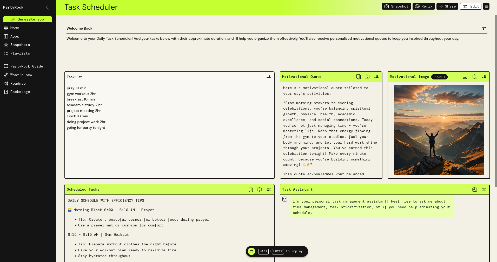

# DailyTaskScheduler-App-PartyRock

## Building a daily task scheduler application using Amazon PartyRock 

>  Here is the my own Demo published App using [PartyRock](https://partyrock.aws/u/Adhil/PAGBXiQFZ/Task-Scheduler).

### overview ☁️

> In this first project, we'll be using PartyRock to develop a 'Daily Task Scheduler Application' aimed at enhancing our productivity and organization. For those not familiar with PartyRock, it's a new         platform offered by AWS designed to simplify app development through the use of generative AI. I've had a lot of fun playing around with PartyRock recently, so I hope you'll also enjoy building this          project.

### Steps to be performed 👩‍💻

    Generating the daily task scheduler application
    Changes in existing widgets
    Adding new widgets
    Publishing your app

### Services Used 🛠

    AWS PartyRock: A fun playground offered by AWS to build applications with generative AI. It helps you make your own apps with AI, without having any coding experience.

### ➡️ Diagram

> This is the homepage of PartyRock:

### ➡️ Final Result

> This is what your project will look like, once built:

